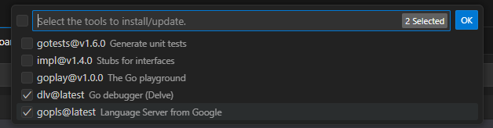

# go-fundamentals
This repository is dedicated to mastering the fundamentals of the **Go (Golang)** programming language. It serves as a practical foundation for my transition into high-performance backend development.

## 🎯 Project Goals
- To build a solid understanding of Go syntax and core concepts.
- To implement Go's unique features like **Goroutines** and **Channels**.
- To follow industry-standard project structures and coding conventions.

## 🛠 Tech Stack
- **Language:** Go (Golang)
- **Tooling:** Go Modules, Git

## Program download
1. https://go.dev/dl/
 - download windows go1.25.6.windows-amd64.msi
2. download vscode : https://code.visualstudio.com/download


## Extension install
- GO

## Go: Install/update Tools > VS Code
view -> command Palette.
   > Go: Install/update Tools 
      [x] dlv@lastest
      [x] gopls@latest
   


# command run go
 go to terminal/go command
 ```go
   > go run helloworld.go
 ```

 The Go Playground
   > https://go.dev/play/
   
 Add module
   create folder calculator/mycal/mycal.go   

 ```go
go mod init mycalculator
 ```
   add command

 
## 📚 Learning Roadmap
- [ ] Variables, Constants, and Basic Types
- [ ] Control Structures (If, For, Switch) 

## 🚀 Git repository
To run any of the examples locally:

1. Clone the repository:
    ```bash
   git clone https://github.com/poommon/go-fundamentals.git
   ```

2. Add push command   
   # save stage and use . for defind git readme 
   ```bash
   git add .
   ```

   # 2.2 save commit and add description 
   ```bash
   git commit -m "docs: add images and update roadmap checkboxes"
   ```

   # 2.3. push to github 
   ```bash
   git push origin main
   ```